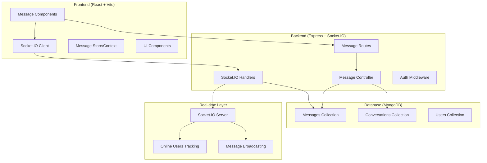

# Messaging Service Design Document

## Overview

The messaging service will be built as a real-time communication system integrated into the existing AgriGrow platform. It leverages the current Socket.IO infrastructure and extends the existing backend architecture with dedicated messaging routes, enhanced models, and a comprehensive frontend interface. The system will provide secure, real-time messaging capabilities with conversation management, online status tracking, and message search functionality.

## Architecture

### High-Level Architecture



### Technology Stack Integration

- **Backend**: Express.js with existing Socket.IO setup
- **Database**: MongoDB with Mongoose (extending current setup)
- **Real-time**: Socket.IO (already configured)
- **Frontend**: React with TypeScript, Radix UI components
- **Authentication**: JWT (using existing auth middleware)
- **State Management**: React Context/Query for message state

## Components and Interfaces

### Backend Components

#### 1. Enhanced Message Model
```typescript
interface IMessage {
  _id: ObjectId;
  senderId: ObjectId;
  recipientId: ObjectId;
  content: string;
  messageType: 'text' | 'image' | 'file';
  isRead: boolean;
  isDelivered: boolean;
  conversationId: ObjectId;
  createdAt: Date;
  updatedAt: Date;
}
```

#### 2. Conversation Model
```typescript
interface IConversation {
  _id: ObjectId;
  participants: ObjectId[];
  lastMessage: ObjectId;
  lastActivity: Date;
  unreadCount: Map<ObjectId, number>;
  createdAt: Date;
  updatedAt: Date;
}
```

#### 3. Message Routes (`/api/messages`)
- `GET /conversations` - Get user's conversations
- `GET /conversations/:conversationId/messages` - Get messages for a conversation
- `POST /conversations` - Create new conversation
- `PUT /messages/:messageId/read` - Mark message as read
- `DELETE /messages/:messageId` - Delete a message
- `GET /search` - Search messages

#### 4. Enhanced Socket.IO Events
```typescript
// Client to Server
interface ClientToServerEvents {
  addUser: (userId: string) => void;
  sendMessage: (data: SendMessageData) => void;
  joinConversation: (conversationId: string) => void;
  leaveConversation: (conversationId: string) => void;
  markAsRead: (messageId: string) => void;
  typing: (data: TypingData) => void;
  stopTyping: (conversationId: string) => void;
}

// Server to Client
interface ServerToClientEvents {
  newMessage: (message: IMessage) => void;
  messageDelivered: (messageId: string) => void;
  messageRead: (messageId: string) => void;
  userOnline: (userId: string) => void;
  userOffline: (userId: string) => void;
  typing: (data: TypingData) => void;
  stopTyping: (userId: string) => void;
}
```

### Frontend Components

#### 1. Core Components Structure
```
src/components/messaging/
├── MessageCenter.tsx          # Main messaging interface
├── ConversationList.tsx       # List of conversations
├── ConversationItem.tsx       # Individual conversation item
├── MessageThread.tsx          # Message thread display
├── MessageInput.tsx           # Message composition
├── MessageBubble.tsx          # Individual message display
├── UserSearch.tsx             # Search users to start conversation
├── OnlineStatus.tsx           # Online status indicator
└── TypingIndicator.tsx        # Typing indicator
```

#### 2. Context and Hooks
```typescript
interface MessageContextType {
  conversations: IConversation[];
  activeConversation: string | null;
  messages: Record<string, IMessage[]>;
  onlineUsers: Set<string>;
  unreadCount: number;
  sendMessage: (content: string, recipientId: string) => void;
  markAsRead: (messageId: string) => void;
  setActiveConversation: (conversationId: string) => void;
}
```

#### 3. Socket Integration Hook
```typescript
const useSocket = () => {
  // Socket connection management
  // Event listeners setup
  // Real-time updates handling
  // Online status tracking
};
```

## Data Models

### Enhanced Message Schema
```javascript
const messageSchema = new mongoose.Schema({
  senderId: { 
    type: mongoose.Schema.Types.ObjectId, 
    ref: 'User', 
    required: true 
  },
  recipientId: { 
    type: mongoose.Schema.Types.ObjectId, 
    ref: 'User', 
    required: true 
  },
  conversationId: { 
    type: mongoose.Schema.Types.ObjectId, 
    ref: 'Conversation', 
    required: true 
  },
  content: { 
    type: String, 
    required: true,
    maxLength: 1000
  },
  messageType: { 
    type: String, 
    enum: ['text', 'image', 'file'], 
    default: 'text' 
  },
  isRead: { 
    type: Boolean, 
    default: false 
  },
  isDelivered: { 
    type: Boolean, 
    default: false 
  },
  editedAt: Date,
  deletedAt: Date
}, { 
  timestamps: true,
  indexes: [
    { conversationId: 1, createdAt: -1 },
    { senderId: 1, createdAt: -1 },
    { recipientId: 1, isRead: 1 }
  ]
});
```

### Conversation Schema
```javascript
const conversationSchema = new mongoose.Schema({
  participants: [{ 
    type: mongoose.Schema.Types.ObjectId, 
    ref: 'User',
    required: true
  }],
  lastMessage: { 
    type: mongoose.Schema.Types.ObjectId, 
    ref: 'Message' 
  },
  lastActivity: { 
    type: Date, 
    default: Date.now 
  },
  unreadCount: {
    type: Map,
    of: Number,
    default: new Map()
  }
}, { 
  timestamps: true,
  indexes: [
    { participants: 1 },
    { lastActivity: -1 }
  ]
});
```

### User Schema Extension
```javascript
// Add to existing User model
const userMessagingFields = {
  lastSeen: { 
    type: Date, 
    default: Date.now 
  },
  isOnline: { 
    type: Boolean, 
    default: false 
  },
  messagingPreferences: {
    allowMessagesFrom: { 
      type: String, 
      enum: ['everyone', 'connections', 'none'], 
      default: 'everyone' 
    },
    emailNotifications: { 
      type: Boolean, 
      default: true 
    }
  }
};
```

## Error Handling

### Backend Error Handling
```typescript
class MessageError extends Error {
  constructor(message: string, public statusCode: number = 500) {
    super(message);
    this.name = 'MessageError';
  }
}

// Error scenarios:
// - Unauthorized message access (403)
// - Conversation not found (404)
// - Invalid message content (400)
// - Rate limiting exceeded (429)
// - Database connection issues (500)
```

### Frontend Error Handling
```typescript
interface MessageErrorState {
  sendError: string | null;
  loadError: string | null;
  connectionError: boolean;
}

// Error recovery strategies:
// - Retry failed message sends
// - Offline message queuing
// - Connection status indicators
// - Graceful degradation for real-time features
```

### Socket.IO Error Handling
```typescript
// Connection error handling
socket.on('connect_error', (error) => {
  // Handle connection failures
  // Implement exponential backoff
  // Show offline indicator
});

// Message delivery confirmation
socket.on('message_error', (error) => {
  // Handle failed message delivery
  // Show error state in UI
  // Provide retry mechanism
});
```

## Testing Strategy

### Backend Testing
1. **Unit Tests**
   - Message model validation
   - Conversation creation logic
   - Authentication middleware
   - Message controller functions

2. **Integration Tests**
   - API endpoint functionality
   - Database operations
   - Socket.IO event handling
   - Authentication flow

3. **Socket.IO Testing**
   - Real-time message delivery
   - Online status updates
   - Connection handling
   - Event broadcasting

### Frontend Testing
1. **Component Tests**
   - Message rendering
   - User interactions
   - State management
   - Error handling

2. **Integration Tests**
   - Socket connection
   - API communication
   - Real-time updates
   - Message flow

3. **E2E Tests**
   - Complete messaging workflow
   - Multi-user scenarios
   - Cross-browser compatibility
   - Performance under load

### Performance Testing
1. **Load Testing**
   - Concurrent user connections
   - Message throughput
   - Database query performance
   - Memory usage monitoring

2. **Real-time Performance**
   - Message delivery latency
   - Connection stability
   - Reconnection handling
   - Scalability limits

## Security Considerations

### Authentication & Authorization
- JWT token validation for all message operations
- User permission checks for conversation access
- Rate limiting for message sending
- Input validation and sanitization

### Data Protection
- Message content encryption in transit (HTTPS/WSS)
- Sensitive data handling in database
- User privacy controls
- GDPR compliance for message deletion

### Socket.IO Security
- Origin validation for socket connections
- Authentication token verification
- Rate limiting for socket events
- Protection against socket flooding

## Performance Optimizations

### Database Optimizations
- Proper indexing for message queries
- Pagination for message history
- Conversation caching strategies
- Database connection pooling

### Real-time Optimizations
- Efficient socket room management
- Message batching for high-frequency updates
- Connection state management
- Memory leak prevention

### Frontend Optimizations
- Virtual scrolling for long message lists
- Message caching and persistence
- Lazy loading of conversations
- Optimistic UI updates

## Integration Points

### Existing System Integration
- Leverage current authentication system
- Extend existing user management
- Integrate with notification system
- Use established API patterns

### Future Extensibility
- Support for group messaging
- File and media sharing
- Message reactions and threading
- Integration with other platform features